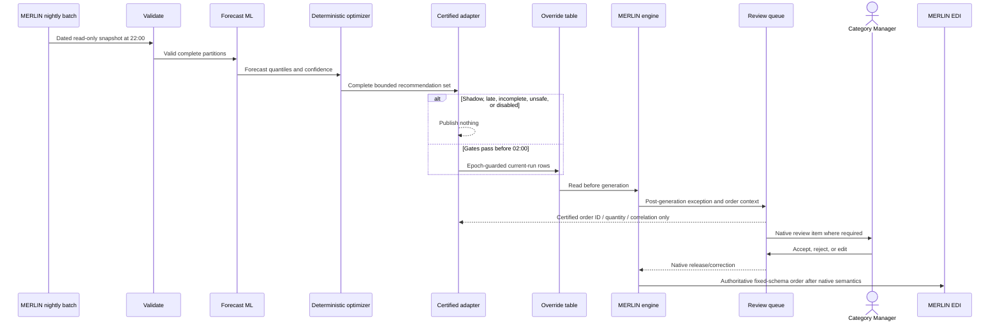

# Artifact 1 - Narrated Batch and Failure Flows

Owner: **LÊ NGUYỄN SỸ BÌNH**

## Flow invariants

- MERLIN never waits for AI and remains the only order generator and EDI sender.
- POS has no AI route, dependency, credential, or runtime change.
- The sidecar uses only the nightly snapshot, override table, and post-generation review queue.
- Forecasts use statistical ML; quantities use deterministic constraints; safety display is deterministic exact evidence, never generated text.
- Missing, late, partial, uncertain, invalid, or disabled AI output means no override.

## Nightly batch flow

| Time | Decision-focused step | Exit gate | Failure behavior |
|---|---|---|---|
| 22:00-22:20 | Receive immutable snapshots; validate schema, checksum, age, completeness, and residency | Required inputs valid | Bypass affected scope |
| 22:20-00:20 | Produce statistical forecasts and confidence intervals | All required partitions complete | Bounded retry only |
| 00:20-01:20 | Apply deterministic case-pack, shelf-life, inventory-interval, DC, and category constraints | Candidate set valid | Suppress invalid rows |
| 01:20-01:30 | Finish the final bounded retry | No new retry after 01:30 | Discard incomplete work |
| 01:30-01:45 | Reconcile partitions, provenance, policy, and signed manifest | Complete set by 01:45 | Publish nothing |
| 01:45-02:00 | Use a certified epoch-guarded adapter within the measured row/lock cap | Commit before 02:00 | Atomic abort/rollback |
| 02:00-04:00 | MERLIN generates, reviews, and sends authoritative EDI | EDI before 04:00 | AI remains closed; MERLIN continues |

The 02:00 close is a proposed gate. Production influence requires measured MERLIN P99 <=90 minutes so at least 30 minutes remain before 04:00; otherwise the close moves earlier. A recovery at 03:30 is rejected as late and cannot trigger a rerun.

## Fail-open decisions

| Trigger | Sidecar action | Authoritative outcome |
|---|---|---|
| Input stale >24 h, completeness <99.5%, checksum/schema/residency failure | Quarantine and bypass | MERLIN continues |
| Partition missing at 01:45 | Discard publish scope | MERLIN continues |
| Low confidence or uncalibrated inventory interval | Suppress row | MERLIN computes incumbent result |
| Permit expired, epoch stale, adapter transaction fails, or clock reaches 02:00 | Reject or roll back; no retry | MERLIN continues |
| Review capacity exhausted | Admit no additional AI exception | Native queue and EDI remain non-blocking |
| AI returns at 03:30 | Retain diagnosis only | Current MERLIN run continues |

## Review and correlation

The sidecar does not obtain or recreate a current MERLIN quantity before publication. After MERLIN generates an order, the supported review queue may return documented order ID, quantity, and correlation keys. The adapter joins them to its exact publication ledger for review and audit. If the fields or non-blocking queue semantics cannot be certified, current-run comparison and automated influence remain disabled; no fourth interface is invented.

## Disable flow

1. Either authorized Duty Manager sets a new `DISABLING` epoch in the local deny-default control.
2. Permit issuance stops immediately; the adapter and access gateway acknowledge within **30 seconds**.
3. The adapter rechecks the current epoch inside the write transaction. New writes are rejected within **60 seconds**; stale work aborts or rolls back.
4. If acknowledgement is missing, an independent SAP identity revokes adapter DB/network access and terminates active sessions.
5. A separate cleanup identity uses the exact AI-owned key/hash ledger to remove only unconsumed rows; manual rows are never selected.
6. `VERIFIED_SAFE` within **5 minutes** requires zero active permits, sessions, transactions, or unexplained AI rows. MERLIN and EDI continue throughout.

Required drills: control loss, stale epoch, check/write race, adapter compromise, missing acknowledgement, out-of-band revocation, session termination, and cleanup failure. Any failed drill keeps the design in shadow.

## Separate associate-copilot request flow

1. A store associate queries the separate copilot device; there is no POS or ordering connection.
2. The router classifies safety versus non-safety intent and retrieves signed, current, market/locale-specific evidence.
3. Safety requests display only the exact approved field/passage plus fixed approved wording and citation. Missing, stale, conflicting, unsigned, or inexact evidence refuses and escalates.
4. Optional language assistance may answer eligible non-safety questions with citations; it cannot compose, paraphrase, translate, or summarize displayed safety content.
5. Query class, source/version/hash, answer or refusal, and escalation are audited. Offline acceptance requires useful eligible answers; universal refusal fails.
