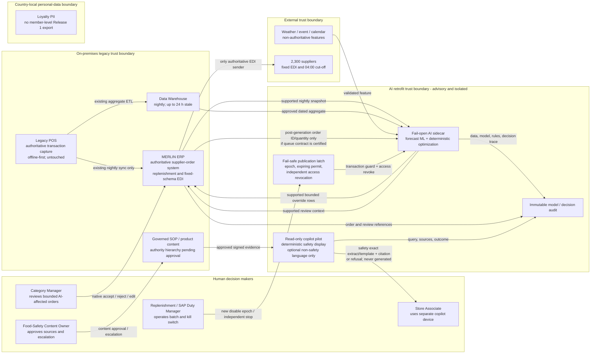
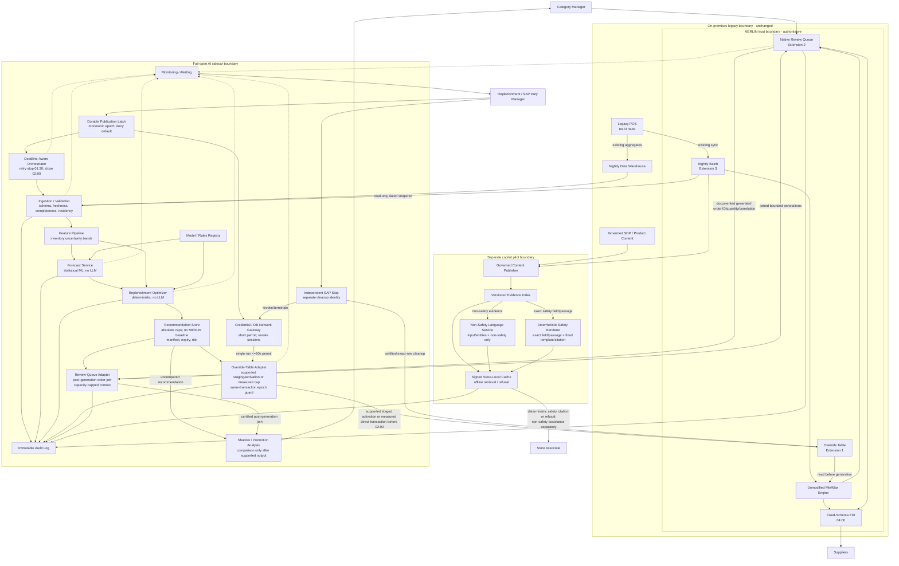

# NovaMart Group 4 - Final Six-Artifact Pack

Owner: ĐINH XUÂN DŨNG (123015, 24R-Humana)

Workshop position: **Variant B - AI-Retrofit / Legacy**

Architecture thesis: Add an asynchronous fail-open AI sidecar that uses statistical forecast ML and deterministic optimization, begins in shadow-assist mode, and may publish only bounded current-run recommendations through MERLIN's supported override table and review queue. MERLIN remains the authoritative order generator and only supplier-EDI sender; no AI output means normal MERLIN replenishment.

Validation status: **PASS CONDITIONALLY for historical replay and shadow mode; REJECT for production replenishment influence and definitive food-safety/allergen answers until every applicable release gate passes.** Planning arithmetic is not benchmark evidence.

## Evidence status used throughout this pack

| Classification | Items |
|---|---|
| Source facts / hard constraints | 640 stores; about 11,000 SKUs/store; 42,000 chain SKUs; conservative 27M forecasts/night; 6x Lunar New Year peak; 22:00-04:00 wall; fixed 04:00 EDI cut-off; 78% inventory accuracy; nightly warehouse up to 24 h stale; MERLIN authority and exactly three extensions; unmodifiable MERLIN engine; untouchable POS; fixed EDI; 8 months; $3.2M delivery constraint; <=$4M/year total AI run cost; 2.4% margin. |
| Architecture decisions | External sidecar; shadow rollout; no pre-publication current MERLIN result; absolute caps; statistical forecast ML; deterministic optimizer; monotonic transaction epoch and out-of-band revoke; deterministic exact safety display; LLM only input/non-safety; no member-level loyalty; deferred markdown/substitution. |
| Planning assumptions to test | 3,840 partitions; 162M/42.24M equivalents; 02:00 close; 70,400/5,000 are policy ceilings only and actual cap follows measured transaction formula; 20-store/two-category pilot; <=100 reviews; $3.8M/year target; staffing. |
| Unresolved release evidence | MERLIN P99; post-generation queue fields/correlation; same-transaction epoch guard; supported staging/activation or direct rate/overhead/lock; independent revoke/cleanup; three 6x benchmarks/bills; review defaults/capacity; inventory calibration; deterministic safety authority/eligible+refusal benchmark; residency; Finance; funded owners. |

---

# Artifact 1 - C4 Context, Container, and Narrated Flows

Owner: LÊ NGUYỄN SỸ BÌNH (122980, ARD)

## 1.1 System context

## 1.2 Container view

## 1.3 Trust boundaries and authoritative systems

| Boundary/system | Authority and allowed crossing |
|---|---|
| MERLIN on-premises boundary | MERLIN is authoritative for merchandising, inventory records, replenishment execution, supplier orders, native review, and EDI. Only nightly batch, override table, and review queue may be used. |
| POS boundary | POS is authoritative transaction capture, offline-first, and entirely isolated. AI is allocated zero calls, dependencies, credentials, and downtime. |
| AI sidecar boundary | Advisory only. It has no pre-publication current MERLIN result. It can activate absolutely bounded current-run rows only through a certified same-transaction epoch guard; it cannot create/send an order or wait-block MERLIN. |
| Country-local loyalty boundary | Member-level loyalty data stays in-country. Release 1 exports zero member records/features to the regional sidecar. |
| Copilot/content boundary | Approved content is candidate authority; source hierarchy and named owners are still gates. Safety output is an exact approved structured field/passage plus fixed approved locale wording and citation, never generated or summarized; otherwise it refuses/escalates. Definitive safety mode stays refusal-only until approval and benchmark evidence pass. |
| External boundary | Weather/events/calendar are non-authoritative features. Suppliers accept only MERLIN's existing fixed-schema EDI before 04:00. |

## 1.4 Narrated nightly batch flow

1. At 21:55 the local control plane verifies a signed, current quorum-latch record `{epoch,state,run_id,scope_hash,manifest_hash,not_after}`. Unreachable, invalid, expired, mismatched, or non-publish state means `BYPASS` or `SHADOW_ONLY`.
2. At 22:00 MERLIN's supported nightly extension emits a dated read-only snapshot/start signal; the warehouse supplies an approved immutable aggregate. No component calls POS.
3. By 22:20 ingestion records IDs, time, schema, checksums, count, completeness, residency class, and age. Critical failure halts AI publication only.
4. Features include sales/promotion/calendar/weather, age/shrink history, and an inventory uncertainty interval. Member-level loyalty is excluded.
5. Statistical ML produces forecast quantiles/confidence. Validation uses 27M normal and 162M 6x forecast equivalents. An LLM produces no number.
6. Deterministic optimization applies whole-case, shelf-life, lead-time, DC, inventory-interval and category constraints to 7.04M stocked candidates (42.24M 6x equivalents). It does not read or recreate a current MERLIN result before publication; the initial absolute maximum is two case packs/store-SKU and the lower source constraint always wins.
7. The recommendation store suppresses invalid/uncertain/out-of-policy rows and requires a complete signed manifest with data/model/rules/audit provenance.
8. In shadow mode, the override adapter is not called and MERLIN receives zero rows. Current-run comparison is permitted only after a documented post-generation queue contract returns generated quantity/order ID/correlation; otherwise the recommendation remains uncompared and cannot influence automation.
9. Only after all gates pass may eligible low-risk rows use supported non-live staging with <=5-second constant-time activation, if certified, or a measured direct transaction whose cap is `min(policy ceiling, floor(R_cert x (L_cert - T_overhead_p99) x 0.80))`, with `L_cert <=60 s`. A short permit and current epoch are rechecked in the same transaction immediately before commit; exact keys/hashes enter an external ledger.
10. At 02:00 the adapter hard-closes even if AI recovers later. No result, retry, or rerun can reclaim the day.
11. MERLIN runs independently, using any valid current-run overrides or its incumbent min/max result when none exists.
12. The native queue receives generated exceptions. Only a certified post-generation contract carrying generated quantity, order ID, and correlation may be joined to exact publication keys and annotated within measured human capacity. Missing/ambiguous correlation keeps influence disabled; excess uses MERLIN and never accumulates.
13. MERLIN alone sends the fixed EDI before 04:00.
14. Model/data/rules versions, latch epoch/permit/acknowledgements, adapter transaction, independent revoke/cleanup, human action, authoritative order/EDI references, and later outcomes are linked in immutable audit. Live runs never self-train.

## 1.5 Human decision and request flows

| Decision point | Human authority | System behavior if no timely decision |
|---|---|---|
| Emergency ordering stop | Replenishment or SAP Duty Manager writes a new global `DISABLING` epoch; independent SAP break-glass may revoke DB/network access and terminate sessions | Control acknowledgements <=30 s; new AI writes rejected <=60 s; verified safe <=5 min; MERLIN continues |
| Category review | Category manager uses native accept/reject/edit/expiry semantics | Admission capped; unreviewed/excess cases use safe incumbent behavior and do not delay EDI |
| Model/scope approval | Model Risk and Replenishment Operations | Unapproved version/scope remains shadow or bypass |
| Safety answer authority | Food-Safety Content Owner, Market Legal/Duty Officer, Product Data Steward | Missing/conflicting/stale/unsigned/inexact evidence produces refusal, hold/check instruction, and escalation |
| Copilot request | Associate asks on separate device; local or central retrieval verifies evidence | Valid evidence returns citation; unavailable evidence returns safe refusal within latency target; POS/order paths are unaffected |

### Category-manager review request flow

1. The optimizer assigns absolute quantity/value, forecast confidence, inventory uncertainty, category risk, promotion state, and deterministic reason codes; it has no current MERLIN quantity before publication.
2. Prohibited/high-risk candidates are suppressed before any MERLIN write; review cannot authorize an invalid result.
3. In shadow mode, a current-run comparison appears only after the certified post-generation queue output is joined to the recommendation. In influence mode, the adapter annotates only exact correlated AI-affected orders within the measured cap; missing fields or correlation keeps influence disabled.
4. After that join, the manager sees the generated MERLIN quantity/order ID, AI quantity, computed delta/value, prediction interval, uncertainty, source age, constraints/reasons, model/rules version, and expiry.
5. Accept/reject/edit/expiry uses existing MERLIN queue semantics. Every action, actor, time, and order reference is audited.
6. If capacity or safe default behavior is unavailable, the candidate uses MERLIN and does not wait or accumulate.

### Associate-copilot request flow

1. An associate asks on the separate copilot device; it verifies signed pack/version/revocation state and identifies product, market, locale, and question domain.
2. Offline, exact eligible cached evidence returns a deterministic cited result; missing/stale/conflicting/invalid evidence returns refusal and the local/phone escalation route.
3. Online, the index retrieves only governed evidence. A language service may classify/translate input, extract entities, or assist with non-safety wording; it may not compose, paraphrase, translate, or summarize allergen, food-safety, recall, sellability, storage, or shelf-life output.
4. For safety, a deterministic renderer selects the exact approved structured field/passage for the exact SKU/market/locale/version and combines it only with fixed pre-approved locale wording and the exact citation.
5. Eligible safety evidence returns that deterministic display with title/version/section and label-check reminder. Every other safety state refuses, advises hold/not-sell where applicable, and escalates.
6. Query class, evidence versions, verifier state, displayed result/refusal, and escalation are committed to audit. Audit failure itself produces refusal.

### Kill-switch request flow

1. Either authorized duty manager writes a new global `DISABLING` epoch and records incident/reason. The monotonic transition path is `DISABLED -> ARMED_SHADOW -> ENABLED_PUBLISH -> DISABLING -> VERIFIED_SAFE -> ARMED_SHADOW`; direct re-enable is invalid.
2. Latch quorum, permit broker, DB/network gateway, orchestrator, and session monitor acknowledge within 30 seconds. The adapter has no standing credential; a run/scope permit expires within 60 seconds, and no new write is accepted after 60 seconds.
3. Missing acknowledgement triggers an independent SAP break-glass identity to revoke credential issuance and DB/network access and terminate sessions. Staged rows remain inert; a stale-epoch/check-write race atomically aborts at the same-transaction guard.
4. A separate cleanup identity/runbook selects only exact unconsumed AI-owned keys/hashes from the external ledger; manual rows are outside the selection.
5. `VERIFIED_SAFE` within five minutes requires no valid permits, sessions, transactions, or unexplained active rows plus complete acknowledgement/revoke/cleanup evidence. Failure leaves `DISABLING` and access revoked while MERLIN continues.
6. Re-enable requires incident closure, clean evidence, a new epoch, a current-data `ARMED_SHADOW` run, and dual approval. Drills cover latch loss, stale epoch, check/write race, adapter compromise, missing acknowledgement, out-of-band revoke, and cleanup failure.

---

# Artifact 2 - Quantified NFR Table

Owner: TRẦN THANH PHỤNG (218924, PH2)

Verdict: **The following are design targets. Shadow mode passes conditionally; production influence is not approved until observed evidence satisfies every critical gate.**

| ID | Requirement and target | Mechanism and calculation | Failure behavior | Metric; warning; critical | Operational owner |
|---|---|---|---|---|---|
| NFR-01 | Batch inside 22:00-04:00; sidecar P95 <=180 min, P99 <=225 min, hard close <=240 min at 02:00 | Four-hour AI wall =14,400 s; at 162M overall floor is 11,250/s. Publication uses certified staged <=5 s activation or direct cap=`min(policy ceiling,floor(R_cert x (L_cert-T_overhead_p99)x0.80))`, `L_cert<=60 s`; 70,400 requires 1,173.4/s raw or 1,760/s with 10 s overhead and 20% headroom; same-transaction epoch guard | Incomplete, stale epoch, expired permit, unsupported activation, or inadequate rate => bypass; writes close 02:00; MERLIN continues | Elapsed, predicted finish, activation/lock/rate, epoch aborts, reserve, EDI. Warn: finish >01:30, P99 >210, reserve <45, measured cap below scope. Critical: P99 >225, write >=02:00, lock >certified limit, AI wait >0 s, reserve <30, EDI >=04:00 | Batch Service Owner TRẦN THANH PHỤNG (218924, PH2) |
| NFR-02 | 100% authoritative orders before 04:00; zero post-cut-off AI write/retry/rerun | Latest close = `04:00 - MERLIN P99 - 30 min`; 02:00 is valid only if P99 <=90 min | Late output retained for diagnosis only; no compensating EDI/rerun | `% before 04:00`, late writes/retries. Warn: projected completion >03:45 or reserve <45. Critical: any 04:00 miss or late write/rerun | Replenishment Operations Owner LÊ NGUYỄN SỸ BÌNH (122980, ARD) |
| NFR-03 | 27M outputs/night; >=30,000 forecast/s at 6x; 100% partition manifest | `42,000 x 640 =26.88M`, validated as 27M. Normal 120-min floor 3,750/s; `162M/7,200=22,500/s` peak floor; target completes in 90 min | Any required partition missing after retry stop invalidates publish scope | Count, throughput, completeness. Warn: <27,000/s for 5 min or incomplete at 01:30. Critical: <22,500/s at peak or missing at 01:45 | Forecast Service Owner PHẠM THỊ THANH HUYỀN (164955, PH2) |
| NFR-04 | Three consecutive 6x nights and every peak night inside same gates; >=25% throughput headroom | 162M forecasts; 42.24M optimizer equivalents; 194.4 GB output/night at 1.2 KB. Targets 30,000 forecast/s and 15,000 optimization/s vs floors 22,500 and 11,733 | Failed headroom/gate => remain/return shadow; MERLIN orders | Throughput, saturation, cost. Warn: headroom <25%, saturation >75% 15 min, annual cost >$3.8M. Critical: below floor, >90% 5 min, >$4M | Platform Capacity Owner NGUYỄN HÒA (122989, PH2) |
| NFR-05 | Rolling-28-day enterprise WAPE <=25%; promotion WAPE <=35%; bounded absolute quantity/value | Promotion features/quantiles/backtests; no pre-publication current MERLIN baseline; initial quantity <=2 case packs/store-SKU and lower of shelf-life, inventory interval, DC allocation, and category caps | Disable bad slice; publish no sidecar row; MERLIN independently computes its result | WAPE, coverage, absolute-cap rejects. Warn: >25% enterprise or >35% promotion for 2 windows. Critical: >30%, >45%, or any hard-constraint breach | Model Owner PHẠM THỊ THANH HUYỀN (164955, PH2) |
| NFR-06 | Copilot online p95 <=1.5 s, p99 <=2.0 s at 150 rps; safety display is deterministic exact extract/template; >=99.5% monthly success | Non-safety budget 200 ms retrieval +850 language +200 policy/citation +200 network +50 render; safety exact path <=650 ms. Language may process input/entities or non-safety assistance only | Safety timeout returns eligible exact cached display or refusal/escalation; never generated fallback | Latency by route, timeout, LLM safety-display calls. Warn: overall p95 >=1.6 s or safety p95 >600 ms. Critical: p95 >=2.0 s, unsafe timeout, or any LLM-composed safety output | Copilot Product Owner TRẦN THANH PHỤNG (218924, PH2) |
| NFR-07 | Offline p95 <=500 ms; signed-pack coverage 100%; eligible non-safety answer coverage >=90% with >=95% answer/citation accuracy; ineligible non-safety refusal precision/recall >=95%; safety policy, eligible exact display/citation, and required-refusal precision/recall all 100%; universal refusal fails | Test 52 disconnected stores; benchmark labels eligible-answer vs required-refusal and measures coverage separately from correctness; stable pack <=7 d and safety revocation <=4 h | Eligible exact/cited answer, or refusal only when policy requires it; empty valid pack/100% refusal fails acceptance | Offline p95, pack coverage, eligible coverage/accuracy, refusal precision/recall by domain. Warn: non-safety metric below target or revocation >3 h. Critical: any safety metric <100%, generated safety, universal refusal, tamper, revocation >4 h without refusal, or p95 >500 ms | Store Technology Owner TRẦN THANH PHỤNG (218924, PH2) |
| NFR-08 | Online substitution Release 1 calls =0; future gate p95 <=400 ms, p99 <=500 ms at approved load | Endpoint absent because interface, RPS, cache, residency, and safe inventory semantics are undefined | Existing non-AI behavior remains | Route/request count. Warn: deployment without signed NFR plan. Critical: any Release 1 production AI substitution request | Online Commerce Owner TRẦN TRỌNG PHÚ (197320, PH2) |
| NFR-09 | Fresh markdown production writes =0; offline analysis 08:00/13:00/17:00 <=30 min/run | Three analyses/day =90 compute-min/day; no production throughput claim without pricing interface/fairness policy | Failure changes no price | Completion/duration/unapproved writes. Warn: <3 runs or >25 min. Critical: any automated write or >30 min if claimed ready | Pricing Product Owner TRẦM QUỐC THUẬN (112287, 24R-Humana) |
| NFR-10 | POS 99.99%, offline and untouched; zero AI dependency/call/downtime | 99.99% allows ~4.38 min/month; AI receives 0 seconds and 0 POS calls; separate copilot device and deny rules | AI failure has no POS effect | Flow/dependency/availability. Warn: undocumented route in pre-production. Critical: production call/artifact or AI downtime >0 s | POS Service Owner NGUYỄN HÒA (122989, PH2) |
| NFR-11 | 100% failure drills preserve MERLIN/EDI; control acknowledgements <=30 s; reject new writes <=60 s; verified safe <=5 min | Durable quorum latch `{epoch,state,run_id,scope_hash,manifest_hash,not_after}`; deny default; no standing writer; <=60 s permit; same-transaction epoch guard; independent DB/network revoke/session termination; separate cleanup identity. Drills include latch loss, stale epoch, check/write race, adapter compromise, missing ack, independent revoke, cleanup failure, and 03:30 recovery | Stale/expired state atomically aborts; staged rows inert; out-of-band access revoked; MERLIN/EDI continue | Ack, permits/sessions, epoch abort, revoke, exact cleanup, MERLIN wait. Warn: ack >30 s or stop >3 min. Critical: new write >60 s, safe >5 min, stale-epoch commit, manual row change, wait >0 s, or stopped ordering | Replenishment Operations Owner LÊ NGUYỄN SỸ BÌNH (122980, ARD) |
| NFR-12 | Annual projection <=$3.8M target; <=$4M hard ceiling; <=$0.0003856/nominal forecast target | `27M x365=9.855B`; `$3.8M/9.855B=$0.0003856`; ceiling $0.0004059. Expected subtotal $3.31242M +$0.48758M contingency | Freeze expansion; throttle non-ordering AI first; never reduce MERLIN | Annualized/daily/unit/untagged. Warn: >$3.8M, >$10,411/day 7-day mean, compute >$0.00011/equiv. Critical: >$4M, >$0.0004059, untagged >1% | FinOps Owner TRẦM QUỐC THUẬN (112287, 24R-Humana) |
| NFR-13 | 100% recommendations carry age and inventory interval; empirical 90% interval coverage >=90%; pilot absolutely capped <=2 case packs/store-SKU plus lower source constraints | 22% error means about `7.04M x22%=1.5488M` potentially wrong; no pre-publication current MERLIN baseline; quantity `<=min(2 case packs, shelf-life sell-through, interval-feasible amount, DC/category cap)` | High/uncalibrated uncertainty suppresses row; MERLIN independently computes its result | Coverage, missing intervals, age, suppression, absolute-cap rejects. Warn: coverage <90% or suppression >30%. Critical: <85%, any published missing interval, or cap/constraint breach at either bound | Inventory Data Owner TRẦN THANH PHỤNG (218924, PH2) |
| NFR-14 | Snapshot <=24 h; required fields >=99.5%; schema/checksum and manifest 100% | At 27M, 0.5%=135k noncritical rows; no missing required partition/hard field. Immutable dated snapshot gates | Critical scope bypass; noncritical defective row suppressed | Age/completeness/partitions/schema. Warn: age >18 h, completeness <99.7%, row delta >2%. Critical: >24 h, <99.5%, missing partition, schema/checksum/residency failure | Data Quality Owner TRẦN TRỌNG PHÚ (197320, PH2) |
| NFR-15 | Safety policy correctness, eligible exact display/citation correctness, and required-refusal precision/recall all 100%; generated safety output=0; escalation ack <=5 min | Exact SKU/market/locale/version structured field/passage + fixed approved locale template/citation; no LLM composition, paraphrase, translation, or summary; output/source hashes audited | Missing/stale/conflicting/inexact/uncited => refusal, hold/check instruction, human escalation | Generated/unsupported output, hashes, policy/display/refusal metrics, revocation, ack. Warn: any benchmark below 100%, revocation >3 h, ack >3 min. Critical: any generated/unsupported/wrong-SKU/invalid-signature display, required safety metric <100%, or ack >5 min | Food-Safety Content Owner TRẦM QUỐC THUẬN (112287, 24R-Humana) |
| NFR-16 | Release 1 automated price decisions =0; 100% offline analysis trace; retain >=5 years pending Legal | No write interface; trace inputs, rules/model, locale, proposal, reason, reviewer; completeness = complete/total | Missing trace blocks output; existing price remains | Writes/audit/fairness. Warn: completeness <100%. Critical: any production write or arbitrary/personalized rule | Pricing Governance Owner TRẦM QUỐC THUẬN (112287, 24R-Humana) |
| NFR-17 | Cross-border member data =0 records/bytes; regional sidecar has 0 member IDs; existing POS retention >=5 years | Exclude member-level loyalty; DLP/egress deny; `11.745B x1.2 KB=14.094 TB/year` derived audit planning | Block/quarantine/bypass scope; POS lifecycle unchanged | DLP/classification/retention. Warn: any unclassified field or retention job failure. Critical: any cross-border personal record/feature or early POS deletion | Data Protection Officer PHẠM THỊ THANH HUYỀN (164955, PH2) |
| NFR-18a | 100% published overrides/safety responses traced before action; audit >=99.99%; retain >=5 years | Append-only/WORM-capable log. Peak hot 30 days: `(162M x14 +27M x16)x1.2 KB=3.24 TB` raw | Audit failure blocks AI action/answer, never MERLIN | Completeness, write availability, hash/orphans. Warn: <99.99% or verifier >2 min. Critical: untraced action, hash mismatch, or in-retention mutation/deletion | Audit and Model Risk Owner LÊ NGUYỄN SỸ BÌNH (122980, ARD) |
| NFR-18b | Named owner and primary+secondary 21:30-04:30; P1 ack <=10 min; primary <=1-in-4; <=2 pages/person/week | Minimum 4 cross-trained platform/data engineers, 2 SAP contacts, model, replenishment, and safety owners; roles may overlap only with proven coverage | Incomplete roster => shadow-only; P1 bypasses AI first | Coverage/pages/ack/drills. Warn: coverage <100%, >2 pages/person/week, ack >5 min. Critical: no backup, ack >10 min, failed bypass, unsafe workaround | AI Service Owner LÊ NGUYỄN SỸ BÌNH (122980, ARD) |
| NFR-19 | LLM-generated forecast/order/price/safety display =0; 100% model inventory; numeric decisions and safety rendering reproducible | Separate identities/registries. Statistical ML forecasts, deterministic optimizer, deterministic safety renderer; LLM only input classification/translation/entity extraction or non-safety language | Unregistered/prohibited route blocks deployment/publication/answer; MERLIN continues and safety refuses | Registry, prohibited calls, reproducibility. Warn: registry/reproducibility <100% nonproduction. Critical: any numeric or safety-display LLM decision or unregistered production model | Model Risk Owner TRẦN TRỌNG PHÚ (197320, PH2) |

### NFR production gates

All gates are mandatory: measured MERLIN P99 reserve; three consecutive 6x tests; certified same-transaction epoch and supported staged activation or direct measured cap/rate/lock; <=30-second acknowledgement, <=60-second write rejection, <=5-minute verified-safe and independent revoke/cleanup drills; certified post-generation order fields/join with no pre-publication baseline; passing data/residency/inventory/WAPE/audit gates; measured non-blocking review capacity; Finance approval; and named funded owners. Safety additionally requires approved authority, deterministic exact display/citation with zero LLM-generated safety text, signed packs/revocation, and the offline eligible-answer/refusal benchmarks above.

---

# Artifact 3 - Weighted Technology-Selection Matrices

Owner: NGUYỄN HÒA (122989, PH2)

Scoring is 1 (poor) through 5 (excellent). `Weighted result = sum(weight x score)/100`; each decision's weights total 100. Continuity, safety, supported interfaces, and deadline compliance were weighted before options were scored. Results authorize only the architecture direction, not production influence.

## 3.1 Integration pattern

| Criterion | A1 supported MERLIN boundary | A2 failure isolation | A3 batch/deadline fit | A4 8-month delivery | A5 rollback/operations | A6 scale/release | A7 architecture completeness |
|---|---:|---:|---:|---:|---:|---:|---:|
| Weight | 25 | 25 | 15 | 10 | 10 | 10 | 5 |

| Option | A1 | A2 | A3 | A4 | A5 | A6 | A7 | Result /5 |
|---|---:|---:|---:|---:|---:|---:|---:|---:|
| External fail-open sidecar | 5 | 5 | 5 | 4 | 5 | 4 | 5 | **4.80** |
| Event-driven across legacy boundary | 2 | 3 | 2 | 2 | 3 | 4 | 4 | 2.65 |
| API gateway / synchronous call | 2 | 2 | 1 | 2 | 3 | 3 | 4 | 2.15 |
| Shadow-assist treated as architecture | 3 | 5 | 5 | 5 | 5 | 2 | 1 | 4.00 |
| In-process MERLIN plugin | 1 | 1 | 4 | 1 | 1 | 1 | 5 | 1.65 |

**Selection:** External sidecar. **Accepted trade-off:** snapshot duplication/divergence in return for isolation; controlled by IDs, checksums, complete manifests, reconciliation, and bounded current-run rows. Shadow remains the rollout mode.

## 3.2 Forecasting platform/execution

| Criterion | B1 6x deadline | B2 cost control | B3 numeric fitness | B4 legacy isolation | B5 trace/reproduce | B6 operational fit |
|---|---:|---:|---:|---:|---:|---:|
| Weight | 25 | 20 | 20 | 15 | 10 | 10 |

| Option | B1 | B2 | B3 | B4 | B5 | B6 | Result /5 |
|---|---:|---:|---:|---:|---:|---:|---:|
| Statistical ML on elastic partitioned batch workers | 5 | 4 | 5 | 5 | 4 | 3 | **4.50** |
| Statistical ML on fixed on-prem cluster | 3 | 3 | 5 | 5 | 5 | 3 | 3.90 |
| Managed AutoML batch | 4 | 3 | 4 | 5 | 3 | 4 | 3.85 |
| LLM-generated forecasts | 1 | 1 | 1 | 2 | 1 | 1 | 1.15 |

**Selection:** Provider-neutral statistical ML on 3,840 elastic, idempotent partitions in an approved region. **Accepted trade-off:** autoscaling/cost-governance complexity rather than permanent 6x capacity. Provider selection waits for >=30,000 outputs/s benchmarks and signed quotes.

## 3.3 Batch orchestration/compute

| Criterion | C1 deadlines/retry | C2 isolation | C3 6x scale | C4 idempotency/audit | C5 nightly-source fit | C6 support/cost |
|---|---:|---:|---:|---:|---:|---:|
| Weight | 25 | 20 | 20 | 15 | 10 | 10 |

| Option | C1 | C2 | C3 | C4 | C5 | C6 | Result /5 |
|---|---:|---:|---:|---:|---:|---:|---:|
| Deadline-aware workflow plus partitioned workers | 5 | 5 | 5 | 5 | 4 | 3 | **4.70** |
| Monolithic scheduled job | 2 | 4 | 2 | 2 | 4 | 4 | 2.80 |
| Always-on streaming/event backbone | 4 | 4 | 5 | 4 | 2 | 2 | 3.80 |
| MERLIN-native/in-process orchestration | 2 | 1 | 1 | 2 | 1 | 2 | 1.50 |

**Selection:** Deadline-aware workflow with maximum two retries, 01:30 retry stop, 01:45 complete-set gate, and 02:00 adapter close. **Accepted trade-off:** more run-state metadata in exchange for bounded retry, scale, traceability, and fail-open behavior. Internal events do not cross MERLIN.

## 3.4 Copilot retrieval

| Criterion | D1 safety/evidence | D2 offline | D3 latency | D4 multilingual | D5 POS/order isolation | D6 cost/support | D7 audit |
|---|---:|---:|---:|---:|---:|---:|---:|
| Weight | 30 | 20 | 15 | 10 | 10 | 10 | 5 |

| Option | D1 | D2 | D3 | D4 | D5 | D6 | D7 | Result /5 |
|---|---:|---:|---:|---:|---:|---:|---:|---:|
| Governed deterministic safety display + optional non-safety language + signed offline packs | 5 | 5 | 4 | 4 | 5 | 3 | 5 | **4.55** |
| Generic cloud chatbot | 1 | 1 | 3 | 5 | 4 | 3 | 2 | 2.25 |
| Keyword search + signed offline packs, no language model | 4 | 5 | 5 | 2 | 5 | 4 | 4 | 4.25 |
| Governed central retrieval without offline pack | 5 | 1 | 4 | 4 | 5 | 4 | 5 | 3.85 |

**Selection:** Governed exact evidence, deterministic safety field/passage rendering with fixed approved locale templates/citations, optional input/entity and non-safety language assistance, and signed local packs. No LLM composes, paraphrases, translates, or summarizes safety output. **Accepted trade-off:** content signing, revocation, deterministic locale templates, and three-language governance are more complex. Definitive safety mode remains refusal-only until all governance gates pass.

---

# Artifact 4 - ADR-001: Fail-Open AI Sidecar Through MERLIN Extensions

Owner: PHẠM THỊ THANH HUYỀN (164955, PH2)

Status: Accepted for replay/shadow; production influence rejected pending gates.

## 4.1 Context

NovaMart needs better forecasts and replenishment while MERLIN remains the supplier-order authority. The engine is unmodifiable, POS is untouchable, supplier EDI/cut-off are fixed, the core lacks automated tests, inventory is 78% accurate, and AI failure cannot stop ordering. MERLIN offers only nightly batch, override table, and review queue extensions.

## 4.2 Decision drivers

- Preserve independent MERLIN min/max/EDI continuity and the fixed 04:00 deadline.
- Use only supported extension points; no POS, EDI, core, or fourth-hook change.
- Convert late, partial, uncertain, stale, invalid, or untraceable AI work into no override.
- Scale/release independently to the conservative 6x case.
- Separate statistical ML, deterministic optimization, deterministic safety rendering, and optional LLM use limited to input/entity handling or non-safety language.
- Begin with zero-impact shadow operation and support an executable local kill switch.
- Keep human review finite and non-blocking.

## 4.3 Options considered

| Option | Decision |
|---|---|
| External fail-open sidecar | **Select:** weighted 4.80/5; best supported-boundary and failure-isolation fit. |
| Event-driven legacy integration | Reject: no source event stream; would invent a fourth MERLIN contract. |
| API gateway/synchronous call | Reject: no real-time replenishment API and AI availability would enter the order path. |
| Shadow-assist | Use as rollout mode, not architecture; it does not define deployment/interfaces. |
| In-process plugin | Reject: violates the unmodifiable, untested, certified-release core boundary. |
| MERLIN replacement/parallel order master | Prohibited. |

## 4.4 Decision

Deploy an asynchronous external sidecar with an on-premises integration/control zone. Read immutable snapshots through the nightly extension; run statistical forecasts and deterministic optimization; stage a complete signed current-run set; and use certified adapters for absolutely bounded override rows and capacity-capped review context only. The sidecar does not read/recreate a current MERLIN result before publication. A certified post-generation queue contract must expose generated quantity, order ID, and correlation and join them to exact publication keys before any current-run comparison or annotation. MERLIN independently generates, reviews, and sends every order.

Shadow-assist is mandatory first. The sidecar stops retry starts at 01:30, requires a complete manifest at 01:45, and closes writes at 02:00. The first gated influence scope is 20 stores, two low-risk non-fresh categories, `min(5,000, measured transaction cap)` rows/night, <=2 case packs/store-SKU subject to lower shelf-life/inventory/DC/category constraints, and <=100 review exceptions/night. Publication requires either a certified supported non-live staging path with <=5-second activation or direct cap=`min(policy ceiling,floor(R_cert x (L_cert-T_overhead_p99)x0.80))`, `L_cert<=60 s`; 5,000 needs 83.4/s raw or 125/s with 10-second overhead and 20% headroom. Unsupported or insufficient capacity means shadow-only.

The fail-safe control is a durable deny-default quorum latch `{epoch,state,run_id,scope_hash,manifest_hash,not_after}` with monotonic states `DISABLED -> ARMED_SHADOW -> ENABLED_PUBLISH -> DISABLING -> VERIFIED_SAFE -> ARMED_SHADOW`. The adapter has no standing credential; a broker issues a single-run/scope permit valid <=60 seconds, and the certified transaction rechecks epoch immediately before commit in the same transaction. Control acknowledgements are <=30 seconds, new writes stop <=60 seconds, and verified safe is <=5 minutes. Independent SAP break-glass revokes DB/network access and terminates sessions; a separate identity cleans only exact unconsumed ledger rows.

## 4.5 Consequences

**Positive:** MERLIN orders through full AI failure; AI scaling/releases stay outside the fragile core; shadow exercises the real path with zero writes; numeric decisions remain reproducible; audit binds snapshots/models/rules/transactions to authoritative orders; rollback changes no MERLIN code.

**Negative / accepted:** snapshot duplication and divergence need reconciliation; the adapter adds certified lock/ownership/cleanup work; a two-system trace and on-call model add operating cost; the four-hour AI wall constrains model runtime; bounded row/review caps intentionally leave some value unrealized; the sidecar does not repair the legacy parameter estate or 78% inventory accuracy; planned $3.8M/year cost is material and unproven.

## 4.6 Risks

Deadline reserve, adapter integrity, inventory uncertainty, peak/model degradation, and human capacity remain material. These risks are controlled by shadow-only default, complete-set publication, hard clock gates, uncertainty intervals, bounded rows, load/failure drills, exact cleanup, and fall back to MERLIN.

## 4.7 Rollback

Write a new global `DISABLING` epoch; reject new permits/writes; use independent SAP break-glass to revoke DB/network access and terminate sessions if any acknowledgement is missing; remove only unconsumed AI-owned exact keys/hashes through the separate certified cleanup identity/runbook; preserve manual rows; use native correction only if MERLIN already consumed a row and the incumbent pre-EDI process allows; never compensate through sidecar EDI or rerun after 04:00. MERLIN continues unchanged. Re-entry requires incident closure, `VERIFIED_SAFE`, clean-table evidence, a new epoch/current-data `ARMED_SHADOW` run, reapproval, and dual operational/model-risk approval. Unsafe cleanup means permanent shadow-only.

## 4.8 Revisit conditions

Revisit if MERLIN interfaces/schedule change; P99 cannot preserve 30 minutes; atomic ownership/cleanup cannot be certified; 6x, WAPE, interval, or cost gates repeatedly fail; review cannot remain non-blocking; new loyalty/pricing/substitution/country requirements alter boundaries; or a material incident disproves fail-open/kill/rollback. Revisiting does not relax MERLIN authority.

## 4.9 Conditions before this ADR may influence orders

Measured MERLIN P99 <=90 minutes for the 02:00 close (or earlier retested close); three consecutive 6x passes; no pre-publication current MERLIN baseline; certified post-generation fields/correlation; same-transaction epoch; supported staged <=5-second activation or direct measured cap/rate/overhead/lock; <=30-second acknowledgement, <=60-second write rejection, <=5-minute verified-safe, independent revoke/session termination, and exact cleanup drills; passing data/residency/interval/WAPE/audit gates; measured safe queue semantics; signed $3.2M delivery and <=$3.8M run cost approvals; and funded named primary/backup owners.

---

# Artifact 5 - Exactly the Top Five Architecture Risks

Owner: TRẦM QUỐC THUẬN (112287, 24R-Humana)

Likelihood and impact are 1-5; `score = likelihood x impact`. Scores are inherent risk before controls.

| ID | Category, description, and cause | L | I | Score | Mitigation | Contingency | Signal and numeric threshold | Owner |
|---|---|---:|---:|---:|---|---|---|---|
| R-01 | **Deadline:** Sidecar or incumbent path misses 04:00 because MERLIN P99 and 6x execution are unmeasured or retry/lock consumes reserve. | 4 | 5 | **20** | Independent MERLIN; 01:30 retry stop; 01:45 complete gate; 02:00 hard close; P99 +30-min reserve; three 6x tests | Discard AI and run MERLIN; 03:30 recovery stays closed; no rerun/sidecar EDI | Warn: finish >01:30 or reserve <45 min. Critical: P99 >225 min, write >=02:00, reserve <30, MERLIN wait >0 s, EDI >=04:00 | Replenishment Operations Owner LÊ NGUYỄN SỸ BÌNH (122980, ARD) |
| R-02 | **Data/commercial:** 78% inventory accuracy and <=24 h-old data cause bad orders; about 1.5488M of 7.04M stocked records may be wrong. | 5 | 4 | **20** | Age + calibrated 90% interval on every row; no pre-publication MERLIN result; quantity <=2 case packs/store-SKU and lower of shelf-life, interval-feasible, DC/category caps; outcome slices | Suppress row/scope; MERLIN independently computes its result; return slice to shadow; never query POS or invent shelf truth | Warn: coverage <90%, age >18 h, suppression >30%. Critical: coverage <85%, missing interval on published row, age >24 h, completeness <99.5%, or absolute cap/constraint breach | Inventory Data Owner TRẦN THANH PHỤNG (218924, PH2) |
| R-03 | **Model/peak:** 3-10x promotions or 6x Lunar New Year degrade quality/capacity due to sparse events and unobserved scale assumptions. | 4 | 4 | **16** | Event features, quantiles, slice backtests, pre-reservation, targets 30,000 forecast/s and 15,000 optimizer/s, three 6x tests | Disable model/slice or all publication; use MERLIN; freeze expansion and retrain offline | Warn: enterprise WAPE >25%, promo >35%, headroom <25%, saturation >75%/15 min. Critical: >30%, >45%, forecast <22,500/s, optimizer <11,733/s, >90%/5 min, or cost >$4M | Model and Platform Capacity Owners TRẦM QUỐC THUẬN (112287, 24R-Humana) |
| R-04 | **Legacy integrity:** Uncertified queue correlation, transaction epoch, ownership, staging/direct rate, locking, or cleanup leads to stale/partial rows, manual-row deletion, or MERLIN delay. | 3 | 5 | **15** | Post-generation queue contract/join; durable monotonic latch; no standing writer; <=60-second permit; same-transaction epoch guard; supported <=5-second staged activation or cap=`floor(R_cert x (L_cert-T_overhead_p99)x0.80)`; raw 70,400 minimum 1,173.4/s; exact ledger | New `DISABLING` epoch; atomic abort/rollback; independent SAP DB/network revoke/session termination; separate exact-row cleanup; permanent shadow if proof fails | Warn: ack >30 s, measured cap below scope, lock nears limit, or stop >3 min. Critical: stale-epoch commit, new write >60 s, safe state >5 min, partial/manual change >0, or MERLIN wait >0 s | SAP Integration Owner TRẦM QUỐC THUẬN (112287, 24R-Humana) |
| R-05 | **Safety/legal:** Copilot returns generated, unsupported, wrong-SKU, stale, or conflicting safety content, or passes offline by refusing everything. | 3 | 5 | **15** | Exact current signed evidence; deterministic exact field/passage + fixed locale template/citation; zero LLM-composed safety text; all safety policy/display/refusal metrics 100%; eligible non-safety offline coverage >=90% and accuracy >=95%; revocation <=4 h; universal refusal fails | Refuse/hold/not-sell; disable affected domain; page Food Safety/Legal/Security; preserve evidence; ordering/POS unaffected | Warn: any benchmark below target, revocation >3 h, ack >3 min. Critical: any generated/unsupported/wrong-SKU output, safety metric <100%, universal refusal, invalid signature, revocation >4 h without refusal, or ack >5 min | Food-Safety Content Owner TRẦM QUỐC THUẬN (112287, 24R-Humana) |

All five exceed tolerance for uncontrolled influence. R-01 through R-04 preserve shadow-only until measured controls pass; R-05 preserves refusal-only safety behavior until governance evidence passes.

---

# Artifact 6 - Variant B Legacy Artifact

Owner: TRẦN TRỌNG PHÚ (197320, PH2)

Status: Replay/shadow only until the gates below pass.

## 6.1 Legacy assessment

MERLIN is a customized SAP-based on-premises ERP operating since 2006. It is the permanent supplier-order authority. Its min/max engine has 340,000 manual parameters, no automated tests, and a twice-yearly certified release. MERLIN exposes exactly three supported extensions: nightly batch, pre-generation override table, and post-generation review queue. POS is offline-first and untouchable; EDI and 04:00 are fixed; inventory is 78% accurate; the warehouse may be 24 hours stale. A failed $22M replacement makes core replacement both prohibited and imprudent.

## 6.2 What can change

| Surface | Allowed change |
|---|---|
| External sidecar | Ingestion/validation, uncertainty features, statistical forecast ML, deterministic optimization, staging, registry, monitoring, immutable audit |
| Nightly extension | Read-only immutable snapshot/start handoff with no incumbent delay |
| Override extension | Certified atomic exact AI-owned current-run rows before hard close |
| Review extension | Capacity-capped provenance on AI-affected generated orders using native actions |
| Operations/analytics | Durable deny-default epoch latch, short permit, independent credential/session revoke, exact cleanup, measured scope caps, replay, post-generation comparison, promotion scenarios, runbooks |
| Separate copilot tool | Deterministic exact safety field/passage + fixed locale template/citation, optional input/entity and non-safety language, signed offline pack, refusal/escalation on non-POS device |
| Approved non-personal plane | Aggregated store-SKU and approved external features; no Release 1 member-level loyalty |

## 6.3 What cannot change

| Surface | Fixed rule |
|---|---|
| MERLIN | Remains merchandising/replenishment/order/EDI authority; engine and schedule have no AI dependency |
| Extension set | No fourth hook; use the three supported points or stay external |
| POS | No code, agent, API, schema, route, credential, device dependency, or recertification impact |
| EDI | No schema, endpoint, timing, sender, supplier contract, or 04:00 change |
| Continuity | Full AI outage still yields incumbent orders/trucks |
| Core strategy | No replacement, strangler, parallel order master, or migration of authority |
| Legal/safety | No cross-border member data, unsupported safety answer, arbitrary automated price, or altered POS retention |

## 6.4 What is unsafe to touch

| Unsafe surface | Safe alternative |
|---|---|
| Min/max code or broad parameter rewrite | Shadow comparison and bounded external override only |
| Undocumented table/manual override rows | Certified adapter and exact-key/hash ledger; no broad deletes |
| MERLIN scheduler/critical path | Independent clock gates; no wait/callback |
| POS runtime/database/network/sync | Existing nightly aggregates only; no sidecar route |
| Supplier EDI connector | MERLIN continues unchanged |
| Point inventory value as truth | Calibrated interval, data age, bounds, suppression |
| Unbounded review queue | Risk-ranked admission cap and safe incumbent fallback |
| Regional member-level loyalty path | Exclude; future country-local lawful design only |
| Generative allergen/safety output | Exact approved structured field/passage + fixed approved locale wording/citation; otherwise refusal/escalation; no LLM-composed safety display |

## 6.5 Selected pattern and rationale

Select an **external asynchronous fail-open sidecar** with on-premises adapters/control. It fits exactly the supported points, keeps MERLIN independent, permits shadow operation, scales/releases outside the core, and supports full provenance. Shadow-assist is the initial **rollout mode**, not a second architecture; internal events do not cross MERLIN. Accepted trade-off is snapshot duplication/divergence. The sidecar has no pre-publication current MERLIN result and uses absolute caps; comparison is allowed only through a certified post-generation generated-quantity/order-ID/correlation join. Without it, no current-run comparison is claimed and influence stays disabled.

## 6.6 Kill switch

A durable quorum latch stores signed `{epoch,state,run_id,scope_hash,manifest_hash,not_after}` with monotonic `DISABLED -> ARMED_SHADOW -> ENABLED_PUBLISH -> DISABLING -> VERIFIED_SAFE -> ARMED_SHADOW`; unknown/unreachable/invalid/expired state denies. The adapter has no standing credential: a broker issues a run/scope permit valid <=60 seconds, and the certified transaction rechecks epoch immediately before commit. Either Duty Manager writes a new global `DISABLING` epoch; all control acknowledgements are due <=30 seconds and no new write is accepted after <=60 seconds. Missing acknowledgement invokes independent SAP break-glass to revoke DB/network access and terminate sessions. A separate identity/runbook cleans only exact unconsumed ledger rows; manual rows are never selected. Verified safe is <=5 minutes. Re-enable requires a new epoch/current-data shadow and dual approval. Drills cover latch loss, stale epoch, check/write race, adapter compromise, missing acknowledgement, out-of-band revoke, and cleanup failure; any failure means shadow-only.

## 6.7 Fail-open behavior

| Failure | Sidecar | MERLIN |
|---|---|---|
| Platform unavailable | No publish; alert | Min/max and EDI continue |
| Incomplete 01:45 / late 02:00 / recovery 03:30 | Discard/close; no retry/rerun | Current run continues |
| Low confidence / high-uncalibrated uncertainty | Suppress | MERLIN independently computes its result |
| Stale/incomplete/schema/checksum/residency fault | Quarantine/bypass | Incumbent inputs/rules continue |
| Constraint or provenance failure | Reject/block | MERLIN independently computes its result |
| Adapter lock/commit fault | Atomic rollback/circuit/kill | Continues after certified release |
| Review cap reached | Admit no more AI cases | Native queue/EDI continue; excess does not accumulate |

## 6.8 Shadow rollout

1. **Contract/timing discovery:** read-only measurement, adapter/queue test harness, owner assignment; no write.
2. **Historical replay:** WAPE/intervals/constraints plus full 6x timing, failure, cost, and trace tests; no MERLIN effect.
3. **Production shadow:** >=4 weeks including promotions; full path; zero override rows; comparison only after certified post-generation output; all fail-safe drills.
4. **Human-reviewed pilot:** only after every gate; 20 stores, two low-risk non-fresh categories, `min(5,000, measured transaction cap)` rows, absolute <=2 case packs/store-SKU plus lower source constraints, and <=100 review exceptions/night.
5. **Bounded influence:** expand explicit store/category configuration while retaining absolute quantity/value, confidence/uncertainty, and measured transaction caps.
6. **Controlled scale:** scale sidecar partitions/support only; authority and three interfaces never change.

## 6.9 Human review

High/prohibited (fresh, safety, price, excessive absolute quantity/value, low confidence, high uncertainty, invalid/untraceable) is suppressed before review. Medium influences only when native timeout/default is proven non-blocking and safe; otherwise suppress. Low is eligible after gates. Admission is the smaller of risk-ranked demand and measured capacity; interim maximum 100/night. Only after the certified queue join do managers see generated MERLIN quantity/order ID, AI quantity, computed delta/value, quantiles, uncertainty, age, constraints/reasons, versions, and expiry. Missing fields/correlation keeps influence disabled. Native action/actor/time is audited; excess uses MERLIN and never queues for later.

## 6.10 Rollback

Disable publication; exact-clean unconsumed AI rows; preserve manual rows; remove only safely supported annotations; keep sidecar shadow or stop it; leave MERLIN parameters/schedule/review/EDI/contracts intact; reconcile and retain evidence; re-enter through shadow and reapproval. No POS/MERLIN code rollback exists because neither was modified. No post-04:00 rerun and no second order authority exist.

## 6.11 Migration without replacing MERLIN

This is external capability adoption, not a core migration. Removing the sidecar at any phase leaves MERLIN fully functional. Expansion changes only sidecar configuration/capacity and certified bounds. It never transfers supplier-order authority, changes min/max, adds an extension, or changes POS/EDI. Production markdown and online substitution remain deferred pending separate interfaces, NFRs, fairness/safety controls, and owners.

## 6.12 Release gates and final Variant B verdict

Production replenishment influence requires: measured MERLIN P99 reserve; three consecutive 6x passes; no pre-publication current MERLIN baseline; certified post-generation generated quantity/order ID/correlation; same-transaction epoch; supported staged <=5-second activation or direct cap=`min(policy ceiling,floor(R_cert x (L_cert-T_overhead_p99)x0.80))` (raw 70,400 minimum 1,173.4/s); <=30-second acknowledgements, <=60-second rejection, <=5-minute verified safe, independent revoke/session termination, and exact cleanup; passing data/residency/interval/WAPE/audit; measured review; Finance approvals; and named owners. Definitive safety answers additionally require approved source hierarchy/accountability, zero LLM-composed safety output, 100% safety policy/exact-display/citation/refusal metrics, offline eligible non-safety coverage >=90% and accuracy/refusal metrics >=95%, universal-refusal rejection, signed pack/<=4-hour revocation, audit, residency, and staffed <=5-minute escalation.

Until then, the correct operational posture is **historical replay + shadow sidecar + non-safety copilot evaluation + refusal-only safety behavior**. MERLIN remains authoritative under every state.

---

## Final consistency statement

- All six artifacts have named owners from the supplied Group 4 roster.
- MERLIN, POS, EDI, the 04:00 wall, inventory uncertainty, and the conditional validator verdict are consistent across all sections.
- Forecasting is statistical ML; replenishment and safety display are deterministic; language models are limited to input/entity handling and non-safety language use.
- The weighted matrices use 100% weights and 1-5 scores; results do not waive gates.
- Artifact 5 contains exactly five quantified risks.
- Planning numbers are explicitly assumptions/targets. No text claims measured production approval.
